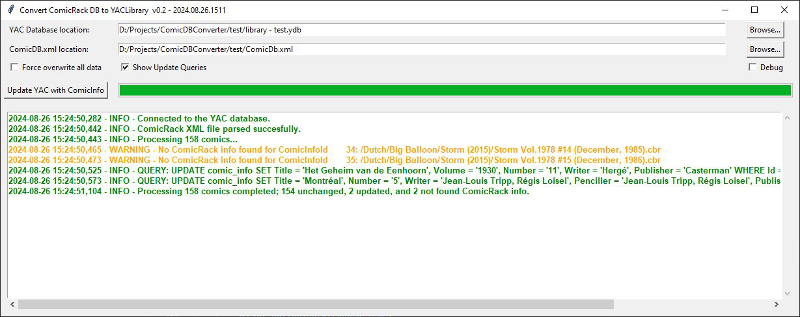

### Import ComicRack information into YAC Library
The **ComicDBConverter** utility reads information from the ComicRack DB (single XML file named `ComicDB.xml`) and
puts all comic information into the YAC library (usually an SQLite database named `library.ydb`).

**ComicDBConverter** assumes that both ComicRack and YAC point to the same directory with comic files, or at least that YAC looks for the same files in a subdirectory of ComicRack files. The matching process between YAC and CR is done on filename. So that means if the filenames do not match, there will not be any information found and updated. **The name includes the path to the filename!**  The filename in the YAC database is used as a reference. Based on this reference, the utility will try to find a matching filename in de ComicDB.xml file. Forward or backslashes are treated similar.

### Important!!

Using the filename as a reference may lead to not having any information updated in the YAC library at all. This usually is the case if the path in the YAC libary includes more a larger path. For instance, if you have setup YACLibrary to point to your files in directory `directory\files\comics\marvel` and ComicRack looks at `comics\marvel\` then there is no match. The other way around however does work, since `comics\marvel\file1.cbr` is partly in `directory\files\comics\marvel\file1.cbr`.

### User interface and Options
The user interface allows you to select the location of the ComicDB.xml file and the YAClibrary. The ComicDB.xml file is usually located in the roaming data folder of your account. This is by default `%AppData%/cYo/ComicRack Community Edition/ComicDb.xml` assuming you use the Community Edition of ComicRack. The YACLibrary is by default located in a directory at the root of your YAC libary; '.yacreaderlibrary/library.ydp'. If you do not set these locations, the utility will fail. Once set, the locations are stored in the .ini file so that they are present when you open ComicDBConverter again at a later time.

There are some options that can be set:
1. **Force update:** will update and overwrite all fields in the database if information has been found
2. **Show Queries:** when this option is checked it will display which SQL queries will be run on the YAC database.
3. **Debug:** shows extensive information for debugging purposes. This will give heaps of log information. This will obviously slow down the process.

The state of the Show Queries option is also set in the configuration file.

### Data that will be updated in YAC Library
The following data will be updated in the YAC library if the information is found in the ComicDB.xml file:

    'Title': Title of the issue
    'Series': Series to which the issue belongs
    'Volume': Volume of the series
    'Number': Issue number
    'Year': This wll add the coverdate of the issue
    'Writer': Name of the author of the issue
    'Penciller': Name of the artist of the issue
    'Inker': Name of the colorist of the issue
    'Publisher': Name of the publishing company
    'Imprint': The imprint as part of the publisher

    'CurrentPage': Set the current page (only if empty in YAC)
    'Read': Set 'Read' if issue is completely read in ComicRack (only if empty in YAC)

For all fields above the value will only be updated in the YAC database if the corresponding value in the YAC library is different. Exception to this is the Read and CurrentPage value. This is only set in the YAC database if it is empty, it will by default not overwrite the value in YAC.

If you want to update all fields, overwriting current values, even if there is no change, you can set the tick box to update ALL fields. Then all fields will be updated in the YAC database.

### Building
There is not much building to be done. After getting the Python files, you can build a Windows executable using pyinstaller. 

1. Optionally, if you want the build date to be updated to the current date, you can call the following in the directory of the sources:

        python buildsetup.py

2. The following command will generate the Windows executable:

        pyinstaller --onefile --windows ComicDBConverter.py

If you want both steps done automatically, I made a small batch file that does both, so you just have to run:

        build.bat

### Notes
- The script will update the YAC database, it assumes that ComicRack is the source of information, and YAC is slaved to that. If there is newer information in the YAC database (i.e. one of the data fields mentioned above has been updated in YAC, excluding 'CurrentPage' and 'Read'), then this will be overwritten. 

- The file dialogs used to locate the `ComicDB.xml` and the `library.ydb` files does not allow to navigate to hidden directories. That means that you may not be able to easily find the ComicDB.xml file stored in the ComicRack program directory. However, you can put the path in the dialog yourself. So, if you navigate to the ComicDB.xml location in a file explorer, and copy the path into the dialog you are good to go. 

- The file **ComicDB.xml will never be changed**. There is no write action to the XML file.

- The `ComicDBConverter` application will store the locations to the library and data files. So, once it has found your ComicDB.xml and library.ydb, you may never have to change that.

### Disclaimer
I wrote this tool out of a personal need. I have been using ComicRack a long time to organize and tag comics. Looking for another way of reading comics natively on iOS and Android, I stumbled upon YACLibraryReader. The reader is pretty good, but I was not willing to rescrape my library to get some basic info into YAC. That is when I started to write this little tool. It fits my need, and I use it always after I do an update on ComicRack. I am sharing this, since there may be other people that can use this. There is no support or guarantee, use at your own risk, however low the risk is.
